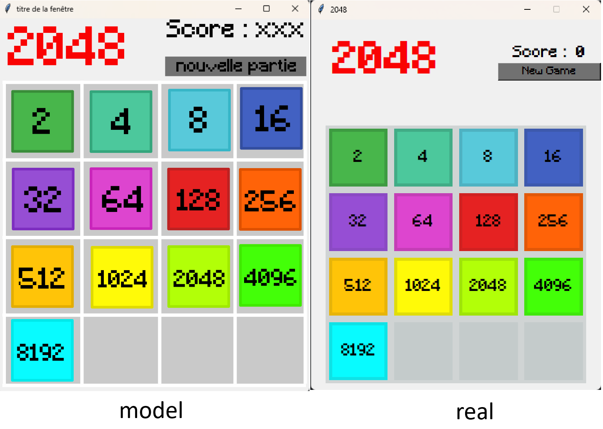

# 2048 Théo Läderach - SPRINT 3

Voici mon projet 2028 pour le cours MA-20

## ⚠️ Prérequis

1. il faut installer la police d'écriture [minecraft.ttf](/Minecraft.ttf)

2. Utiliser les bonnes branches en fonction du sprint [Aller au référence](#-sprint)

Sprint

[sprint 2](https://github.com/pj43svh/MA-20-2048_Theo_Laderach/tree/deuxi%C3%A8me-sprint)

[sprint 3](https://github.com/pj43svh/MA-20-2048_Theo_Laderach/tree/troisi%C3%A8me-sprint)

